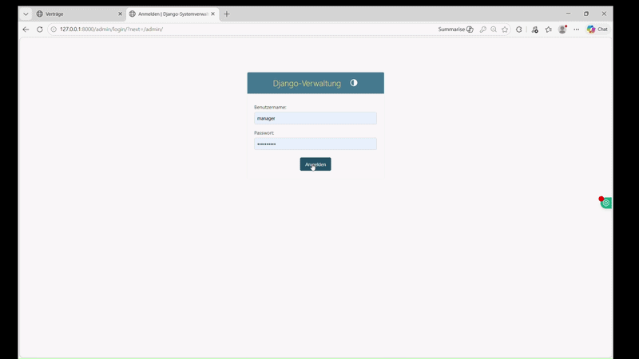
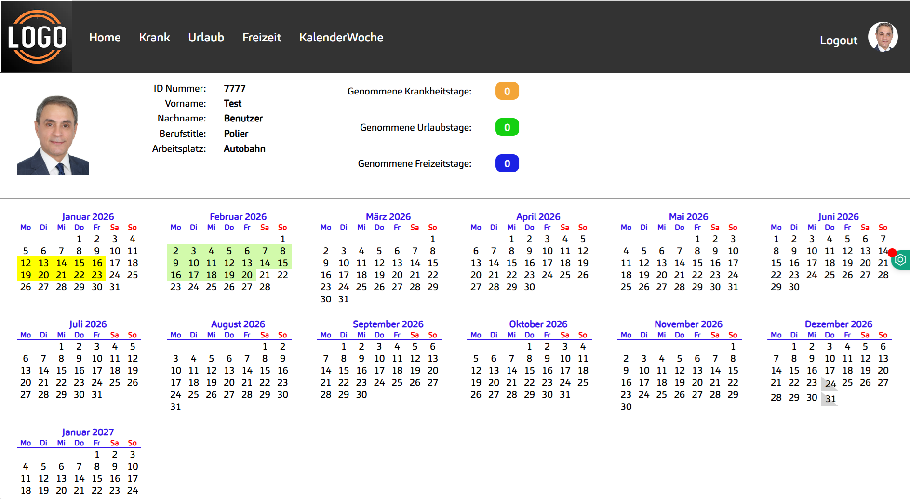
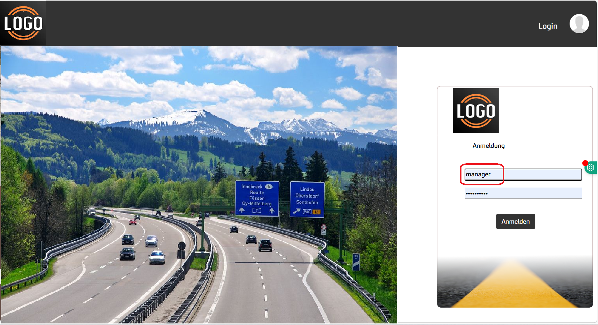
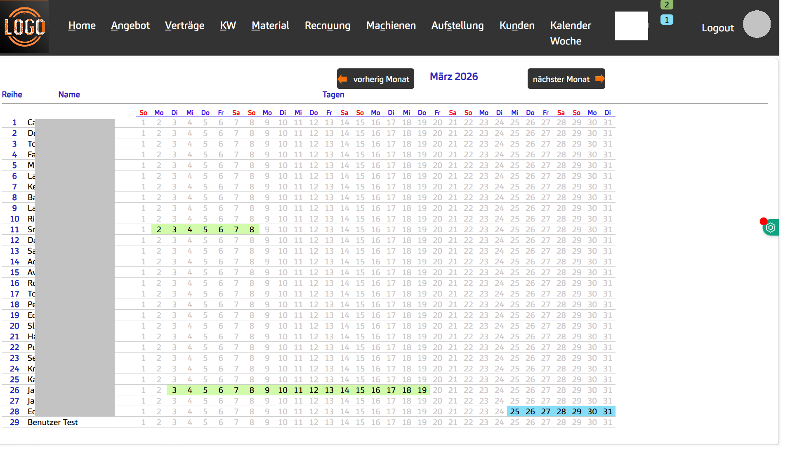
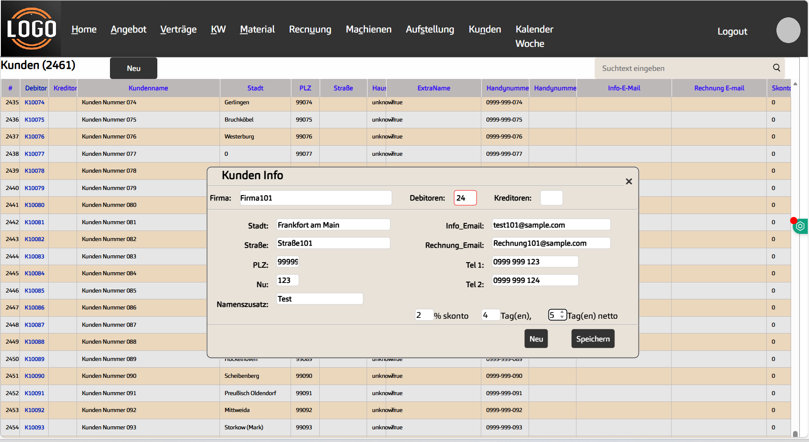
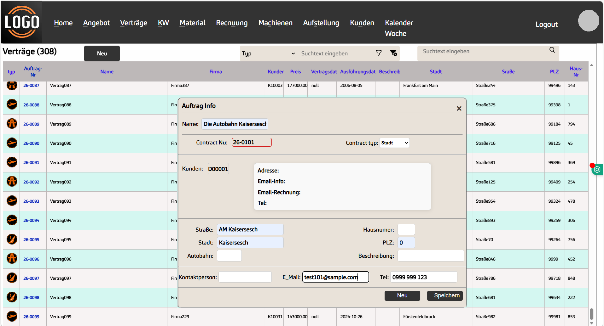
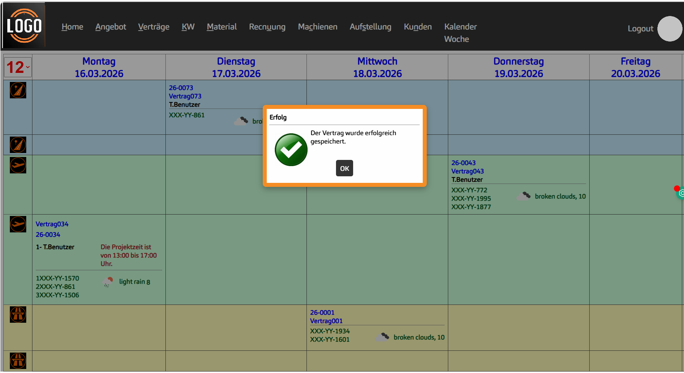

# 🚧 Highway Painting Management System

A Python-based management system designed to streamline highway painting operations, employee coordination, and contract 
handling with a focus on efficiency and real-world constraints such as weather conditions.

---

## 🎬 Demo

  

---

## 🧠 Problem

Highway painting projects require precise coordination between employees, contracts, and environmental conditions.  
Manual management often leads to:

- Scheduling conflicts  
- Inefficient resource allocation  
- Delays due to weather dependency  

---

## 💡 Solution

This system centralizes all operations into one platform, enabling:

- Structured employee and role management  
- Efficient contract and customer tracking  
- Weekly project planning with weather awareness  

---

## ⚙️ Key Features

### 🔐 Authentication & Role Management
- Secure login system  
- Role-based access (Employee / Manager / Admin)

  

---

### 📝 Leave Management System
- Submit leave and sick requests  
- Manager approval workflow  

  

---

### 🔐 Authentication & Role Management
- Secure login system  
- Role-based access Manager 

  

---

## 🧠 Problem

A lot of time is spent on requesting leave and sick leave, and paper is used to do these things.

- Too much paper
- To much Time to receive request

## 💡 Solution

Requests are sent online to Human Resources or Management, eliminating bureaucracy and paper usage. The result of the 
leave request is also sent to the employee instantly by automatic Email, SMS, or WhatsApp.

- Eliminating bureaucracy and paper usage
- Online response via SMS, Email, WhatsApp
  
### 🔐 Confirmation Leave / Sick leave
+
- Role-based access Manager

  

---

### 👥 Customer Management
- Store and manage customer records  

  

---

### 📄 Contract Management
- Track contracts and project details  

  

---

### 📅 Weekly Project Planning
- Assign employees to projects  
- Manage locations and conditions  
- Integrate weather dependency into planning  

  

---

## 🛠 Tech Stack

- Python  
- Django (Web Framework)  
- SQLite (Database) 

---

## 🎯 Key Highlights

- Designed for real-world operational constraints  
- Focus on usability and workflow efficiency  
- Demonstrates full-cycle application logic (authentication, data management, reporting)

---

## ⚠️ Note

All data and company names have been anonymized for confidentiality.
