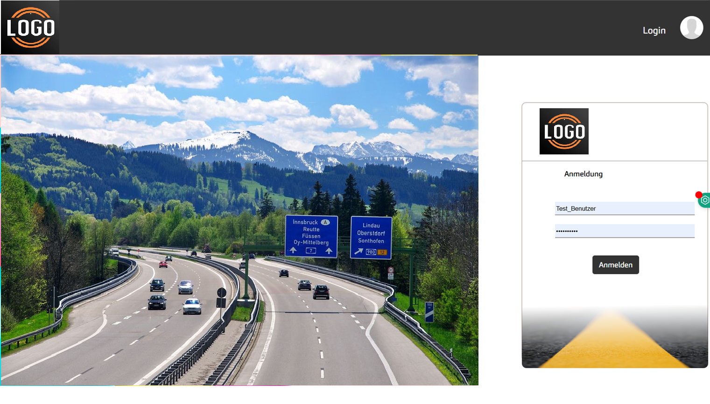

# Highway Painting Management System

A Python-based system for managing highway painting operations, employees, and contracts.

---

## 🎬 Demo

  

---

## 🔐 Authentication System

- User login (Employee / Manager)
- Admin login

  

---

## 📝 Leave Management

- Leave request
- Approval by manager

  
  

---

## 👥 Customer Management

  
  

---

## 📄 Contracts

  
  

---

## 📅 Weekly Projects

- Project assignments
- Addresses
- Conditions
- Weather dependency (important for painting)

  

---

## ⚠️ Note

All data and company names have been anonymized for confidentiality.
